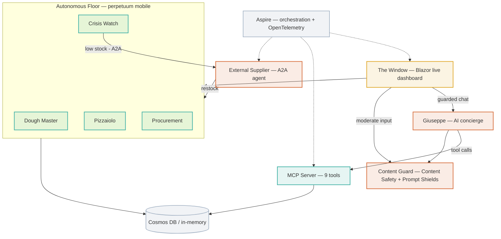

# 🍕 Copilot Pizza Factory


-46b36a?style=flat-square)


An **AI-first demo** of a pizza factory that runs itself — a "perpetuum mobile" where autonomous
agents take orders, rest dough, bake pizzas, watch stock, and reorder from an external supplier when
they run low. Humans drop in only when judgment is needed.

It's built to work on **two flight levels at once**: a *business* story (a self-running operation that
heals its own supply chain and pulls people in only when it matters) and a *technical* story (MCP tool
servers, an Agent-to-Agent supplier, Responsible-AI guardrails, a chat agent, Cosmos DB, and .NET
Aspire orchestration — all key-less). Smart, a little playful, genuinely runnable.

Built on **.NET 10**.

## Run it locally (zero Azure required)

The whole factory runs in-memory with no cloud dependencies — perfect for a first look:

```bash
# The Aspire "control tower" (dashboard + all services)
dotnet run --project src/PizzaFactory.AppHost

# …or just the Window dashboard on its own
dotnet run --project src/PizzaFactory.Web
```

Open the **Window**: order a pizza, watch it cross the stations live, chat with Giuseppe (when a model
is configured), and see the "Bouncer" block bad input. With no Azure configured it falls back
gracefully — in-memory store, Giuseppe "off the clock", no external supplier.

Run the tests:

```bash
dotnet test src/PizzaFactory.sln
```

---

## 🛫 Two flight levels

The same running system tells two stories. Pick the altitude for the room in front of you — the
machinery underneath doesn't change.

| | Altitude | You'll find |
|---|---|---|
| 🛫 | **[Business](#-business-flight-level--what-the-audience-sees)** | Five demo beats and why each one lands with non-technical stakeholders |
| 🛬 | **[Technical](#-technical-flight-level--how-its-built)** | Architecture, the "see ↔ hood" bridge, and the engineering patterns worth showing |

### 🛫 Business flight level — what the audience sees

Five moments that land with non-technical stakeholders. Each is a real, live behaviour of the running
system — not a slide.

| # | Use case | What the audience sees | Why it lands |
|---|---|---|---|
| **01** | **Order & watch** | Order a pizza from a public page and watch it cross the floor in real time — your order, your name on the big screen. | The room is part of the demo. |
| **02** | **Self-healing supply chain** | A run on Hawaii pizzas drains the pineapple; the factory notices, reorders from an external supplier on its own, and keeps the line moving. | Operations that recover from disruption without a human firefight. |
| **03** | **Ask Giuseppe** | A warm AI pizzaiolo takes orders and answers questions in plain language — the friendly face over a real operation. | Natural-language access to live operations and customer service. |
| **04** | **The perpetuum mobile** | Leave it running. Dough rests, pizzas bake, stock replenishes — with nobody at the controls. | A business process that simply runs itself, around the clock. |
| **05** | **The Bouncer** | Open a public input box at a conference and trolls will come. A Responsible-AI guard blocks abuse and prompt-injection before it ever reaches the screen. | Trustworthy, compliant AI — brand-safe by design. |

### 🛬 Technical flight level — how it's built

.NET 10, orchestrated by Aspire. Agents collaborate over open protocols (MCP & A2A); the cloud is
config-driven and key-less, so the whole thing also runs fully in-memory with zero Azure.



**What you see ↔ what's actually happening** — the bridge a presenter walks during the demo:

| What the audience sees | What's actually happening |
|---|---|
| A pizza is ordered and crosses the floor live | Blazor Server circuit re-renders a `FactorySnapshotProvider` polled over the repositories |
| The factory runs with nobody touching it | Autonomous `BackgroundService` loops (Dough Master / Pizzaiolo / Procurement) ticked on a `TimeProvider` |
| "We're low on pineapple" → reordered automatically | `CrisisWatch` raises an escalation → `ISupplierGateway` calls the external **A2A** agent → stock refilled |
| You chat with Giuseppe | Custom-engine agent on Azure OpenAI `gpt-5.2-chat`, every message content-guarded first |
| Trolls get blocked, a counter ticks | Azure AI Content Safety + Prompt Shields behind one `IContentGuard` seam |
| "How's the line doing?" | `station_status` tool answered over the **Model Context Protocol** (Streamable HTTP) |
| It's all in the cloud, yet no passwords anywhere | Managed identity / `DefaultAzureCredential` — zero keys in source |

**Engineering patterns worth showing:**

- **Key-less everywhere** — no secrets in source; managed identity / `DefaultAzureCredential` for Cosmos, Content Safety, and Azure OpenAI alike.
- **MCP tool server (GA)** — 9 tools over Streamable HTTP, verified end-to-end with a real MCP client; driveable by Copilot, agents, or dev tools.
- **Agent-to-Agent supplier (preview)** — a separate service publishes an A2A agent card; the factory negotiates restock behind an `ISupplierGateway` seam.
- **Guardrail as a seam** — one `IContentGuard`; swap the offline heuristic for cloud Content Safety + Prompt Shields by config. Fails closed.
- **Autonomous loops on `TimeProvider`** — `StepAsync(now)` instead of wall-clock timers, so the factory's behaviour is deterministic in tests.
- **Swappable persistence** — repository interfaces with in-memory *and* Cosmos implementations; flip one DI line, runs cloud-free for local dev.
- **Tested & live-verified** — ~87 tests; Cosmos, Content Safety, and Giuseppe each have env-gated integration tests that prove the real services.

## What's inside

| Project | What it shows |
|---|---|
| `PizzaFactory.Domain` | The pizza domain — recipes, ingredients, immutable `Order`/`Pizza`/`Stock`/`Dough` + state machines. Persistence-agnostic. |
| `PizzaFactory.Infrastructure` | Repositories: in-memory **and** Cosmos DB (key-less, `DefaultAzureCredential`). |
| `PizzaFactory.Factory` | The **perpetuum mobile** — Dough Master / Pizzaiolo / Procurement background loops, `CrisisWatch`, and the self-healing supplier path. |
| `PizzaFactory.Mcp` | A **Model Context Protocol** server (Streamable HTTP) exposing 9 tools over the factory (orders, inventory, recipes, live telemetry). |
| `PizzaFactory.Safety` | **Responsible-AI guardrail** — offline heuristic + Azure AI Content Safety & Prompt Shields, behind one interface. |
| `PizzaFactory.FrontOfHouse` | Public guest intake — auto pseudonyms (zero-PII), moderation, an ordering **kill-switch**. |
| `PizzaFactory.Giuseppe` | The **AI concierge** — a guarded chat agent on Azure OpenAI. |
| `PizzaFactory.Supplier` | An **external Agent-to-Agent (A2A)** supplier — publishes an agent card and fulfils restock requests. |
| `PizzaFactory.Web` | The **"Window"** — a Blazor dashboard that hosts the running factory and shows it live (board, order form, Giuseppe chat, Trust & Safety feed). |
| `PizzaFactory.AppHost` / `ServiceDefaults` | **.NET Aspire** orchestration + OpenTelemetry. |

## The tech, in one breath

.NET 10 · .NET Aspire · Blazor (interactive Server) · Azure Cosmos DB · Model Context Protocol (MCP) ·
Agent-to-Agent (A2A) · Azure AI Content Safety + Prompt Shields · Azure OpenAI · **key-less throughout**
(managed identity / `az login`, no secrets in source) · ~87 tests.

## Optional: run on Azure (key-less)

Everything cloud-bound is config-driven and authenticated with managed identity — **no keys**. Set any
of these (e.g. via environment or the Aspire AppHost) to light up the real services; leave them unset
to stay fully local:

| Setting | Enables |
|---|---|
| `Cosmos:Endpoint` | Persist to Azure Cosmos DB instead of in-memory |
| `ContentSafety:Endpoint` | Cloud moderation + Prompt Shields (vs. the offline heuristic) |
| `Giuseppe:Endpoint` + `Giuseppe:Deployment` | Giuseppe on an Azure OpenAI deployment |
| `Supplier:Endpoint` | The external A2A supplier for self-healing restock |

## License

[MIT](LICENSE).
