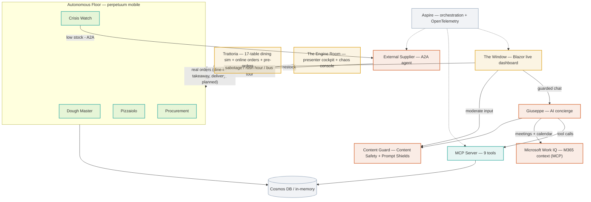

# 🍕 Copilot Pizza Factory


-46b36a?style=flat-square)


An **AI-first demo** of a pizza factory that runs itself — a "perpetuum mobile" where autonomous
agents take orders, rest dough, bake pizzas, watch stock, and reorder from an external supplier when
they run low. Humans drop in only when judgment is needed.

It's built to work on **two flight levels at once**: a *business* story (a self-running operation that
heals its own supply chain and pulls people in only when it matters) and a *technical* story (MCP tool
servers, an Agent-to-Agent supplier, Responsible-AI guardrails, a chat agent, Cosmos DB, and .NET
Aspire orchestration — all key-less). Smart, a little playful, genuinely runnable.

Built on **.NET 10**.

## Run it locally (zero Azure required)

The whole factory runs in-memory with no cloud dependencies — perfect for a first look:

```bash
# The Aspire "control tower" (dashboard + all services)
dotnet run --project src/PizzaFactory.AppHost

# …or just the Window dashboard on its own
dotnet run --project src/PizzaFactory.Web
```

Open the **Window** — now a full business dashboard — and press **▶ Open the floor**: a 17-table
trattoria comes to life. Parties arrive, get seated on the live floor map, order (real orders on the
real factory), wait, eat, pay, and leave star reviews in the ticker — while online orders ping in
over four channels (🌐 web · 💬 chat · 🤖 Copilot · 📞 phone) for takeaway and delivery, and
pre-orders ("10× Diavolo, Saturday 18:00, Nonna's Bingo Club") wait in the book and fire on
schedule. You can still order a pizza yourself, chat with Giuseppe (when a model is configured),
and watch the "Bouncer" block bad input. With no Azure configured it falls back gracefully —
in-memory store, Giuseppe "off the clock", no external supplier.

Then visit **`/storefront`** — the restaurant's "public" website, Trattoria Giuseppe: browse the
menu with real prices, order takeaway/delivery, reserve pizzas ahead, and chat with the storefront
concierge. Everything a customer does there lands on the house's real boards and books. (The page
plays "public": deployed, it sits behind Microsoft Entra like every other surface of this demo —
only our tenant can open it.)

Then open **`/engine-room`** — the presenter's cockpit. A live watch-along of the whole line, a
pantry you can sabotage, a **Chaos Console** (drain the pineapple, unleash a 100-order rush hour,
reset everything), a ticker of escalations, and a **👔 Suits / 🤓 Nerds toggle** that switches every
panel's talk-track annotation between the business story and the engineering story. Break the factory
on cue; watch it heal itself.

Run the tests — including the **E2E suite**, which boots the real app and clicks through both
pages in a headless browser (ordering, chat degradation, every chaos button):

```bash
dotnet test src/PizzaFactory.sln          # unit + integration + E2E (first E2E run downloads Chromium)
dotnet test src/PizzaFactory.E2eTests     # just the browser journeys
```

---

## 🛫 Two flight levels

The same running system tells two stories. Pick the altitude for the room in front of you — the
machinery underneath doesn't change.

| | Altitude | You'll find |
|---|---|---|
| 🛫 | **[Business](#-business-flight-level--what-the-audience-sees)** | Five demo beats and why each one lands with non-technical stakeholders |
| 🛬 | **[Technical](#-technical-flight-level--how-its-built)** | Architecture, the "see ↔ hood" bridge, and the engineering patterns worth showing |

### 🛫 Business flight level — what the audience sees

Five moments that land with non-technical stakeholders. Each is a real, live behaviour of the running
system — not a slide.

| # | Use case | What the audience sees | Why it lands |
|---|---|---|---|
| **01** | **Order & watch** | Order a pizza from a public page and watch it cross the floor in real time — your order, your name on the big screen. | The room is part of the demo. |
| **02** | **Self-healing supply chain** | A run on Hawaii pizzas drains the pineapple; the factory notices, reorders from an external supplier on its own, and keeps the line moving. | Operations that recover from disruption without a human firefight. |
| **03** | **Ask Giuseppe** | A warm AI pizzaiolo takes orders and answers questions in plain language — the friendly face over a real operation. | Natural-language access to live operations and customer service. |
| **04** | **The perpetuum mobile** | Leave it running. Dough rests, pizzas bake, stock replenishes — with nobody at the controls. | A business process that simply runs itself, around the clock. |
| **05** | **The Bouncer** | Open a public input box at a conference and trolls will come. A Responsible-AI guard blocks abuse and prompt-injection before it ever reaches the screen. | Trustworthy, compliant AI — brand-safe by design. |
| **06** | **Cater my meeting** | "Giuseppe, order pizza for Friday's retro" — he finds the meeting, counts heads, remembers the vegetarian, and places real orders. | AI that knows *your* world, not just its own menu. |
| **07** | **The prank radar** | Someone asks for 100 pizzas "lol". Giuseppe raises an eyebrow and asks for a real headcount — and the factory's ordering tool has a hard cap of its own. | AI with common sense *and* guardrails underneath it. |
| **08** | **The Engine Room** | The presenter opens a second view, drains the pineapple live, floods the floor with a lunch rush — and the factory recovers on its own, on stage. | A demo you can steer beats a demo you can only survive. |
| **09** | **The storefront** | Customers browse the menu, order delivery, and reserve on the "public" website — by form or by chatting with Giuseppe — and every action appears live on the house's boards. Ask the storefront chat for the business report: charming refusal. | One brand, two hats: the public agent physically cannot reach the back office. |
| **10** | **Dinner service** | Press ▶ Play: a 17-table floor map fills with live parties who order, dine, and leave reviews; online orders arrive over web, chat, Copilot, and phone; pre-orders fire on schedule. Reviews sour honestly when the kitchen falls behind. | The whole business on one screen — demand, operations, and customer satisfaction, causally connected. |
| **11** | **Trattoria Command in Copilot** | Ask Microsoft 365 Copilot "how is tonight looking at the trattoria?" — and instead of a wall of text, a living cockpit renders inside the chat: tables, kitchen line, revenue pace, the crystal ball. One click expands it to a fullscreen war room. *(SPFx Copilot Apps, preview)* | Nobody expects Copilot to answer with an app. The manager's whole world, without leaving the chat. |

### 🛬 Technical flight level — how it's built

.NET 10, orchestrated by Aspire. Agents collaborate over open protocols (MCP & A2A); the cloud is
config-driven and key-less, so the whole thing also runs fully in-memory with zero Azure.


```mermaid
graph TD
  classDef biz fill:#e0a92e22,stroke:#e0a92e,stroke-width:2px;
  classDef tech fill:#46b3a822,stroke:#46b3a8,stroke-width:2px;
  classDef warm fill:#d8703f22,stroke:#d8703f,stroke-width:2px;
  classDef data fill:#97a8bc22,stroke:#97a8bc,stroke-width:1.5px;

  WIN["The Window — Blazor live dashboard"]:::biz
  TRAT["Trattoria — 17-table dining sim + online orders + pre-orders"]:::biz
  ENG["The Engine Room — presenter cockpit + chaos console"]:::biz
  subgraph FLOOR["Autonomous Floor — perpetuum mobile"]
    DM["Dough Master"]:::tech
    PZ["Pizzaiolo"]:::tech
    PR["Procurement"]:::tech
    CW["Crisis Watch"]:::tech
  end
  GIU["Giuseppe — AI concierge"]:::warm
  GUARD["Content Guard — Content Safety + Prompt Shields"]:::warm
  MCP["MCP Server — 9 tools"]:::tech
  SUP["External Supplier — A2A agent"]:::warm
  DB[("Cosmos DB / in-memory")]:::data
  ASP["Aspire — orchestration + OpenTelemetry"]:::data

  WIQ["Microsoft Work IQ — M365 context (MCP)"]:::warm

  WIN --> FLOOR
  TRAT -->|"real orders (dine-in, takeaway, delivery, planned)"| FLOOR
  ENG -->|"sabotage / rush hour / bus tour"| FLOOR
  WIN -->|"guarded chat"| GIU
  WIN -->|"moderate input"| GUARD
  GIU -->|"tool calls"| MCP
  GIU -->|"meetings + calendar"| WIQ
  GIU --> GUARD
  FLOOR --> DB
  MCP --> DB
  CW -->|"low stock - A2A"| SUP
  SUP -->|"restock"| FLOOR
  ASP -.-> WIN
  ASP -.-> MCP
  ASP -.-> SUP
```

**What you see ↔ what's actually happening** — the bridge a presenter walks during the demo:

| What the audience sees | What's actually happening |
|---|---|
| A pizza is ordered and crosses the floor live | Blazor Server circuit re-renders a `FactorySnapshotProvider` polled over the repositories |
| The factory runs with nobody touching it | Autonomous `BackgroundService` loops (Dough Master / Pizzaiolo / Procurement) ticked on a `TimeProvider` |
| "We're low on pineapple" → reordered automatically | `CrisisWatch` raises an escalation → `ISupplierGateway` calls the external **A2A** agent → stock refilled |
| You chat with Giuseppe | Custom-engine agent on Azure OpenAI `gpt-5.2-chat`, every message content-guarded first |
| Trolls get blocked, a counter ticks | Azure AI Content Safety + Prompt Shields behind one `IContentGuard` seam |
| "How's the line doing?" | `station_status` tool answered over the **Model Context Protocol** (Streamable HTTP) |
| It's all in the cloud, yet no passwords anywhere | Managed identity / `DefaultAzureCredential` — zero keys in source |
| "Order pizza for Friday's retro" just… works | A `Microsoft.Extensions.AI` function-calling loop over **two MCP servers at once** — our factory tools and Microsoft's **Work IQ** (live M365 calendar) — with a deterministic rehearsal fallback so the demo can't die on stage |
| 100-pizza prank gets an eyebrow, not an invoice | Persona-level prank radar **plus** a hard `create_order` cap at the MCP boundary — defense in depth, with jokes |
| The presenter breaks the factory and it heals | Engine Room chaos buttons drive `DemoDirector` against the **same repositories** the autonomous floor runs on — real sabotage, real recovery |
| Tables fill, guests dine, reviews roll in | `MaitreD`/`OnlineOrderDesk`/`PreOrderBook` step on a `TimeProvider` and place **real orders**; the new `Expeditor` station completes tickets when every pizza is out of the oven |
| A slow kitchen earns one-star reviews | Feedback stars derive from actual food wait time — sabotage the pantry and watch satisfaction drop, causally |
| "Giuseppe, book 10 Diavolo for Saturday 18:00" | The trattoria's front desk hands the agent its reservations book as tools (`list_pre_orders`, `book_pre_order`, `dining_room_status`) — the booking lands in the same `PreOrderBook` the UI shows |
| "Status report — how are we doing tonight?" | The `Bookkeeper` aggregates the REAL order stream (revenue via a price list, channels, top seller, guests, stars) plus an honest pace projection and a seeded 7-day ledger for "versus a typical Tuesday" — Giuseppe narrates it like a proud owner |
| "What will go wrong soon?" | `forecast_risks` cross-references stock against committed demand (open orders + reservations firing within 3h), the dough buffer, and seating pressure — severity-ranked risks with the arithmetic behind each, and Giuseppe adds a mitigation per risk |
| The storefront chat can't leak the ledger | **One brain, two hats**: the same `GiuseppeAgent` machinery runs twice — the house instance with the full tool belt, the storefront instance with customer tools only (`browse_menu`, `place_online_order`, `book_reservation`, `check_order_status`). Personas are voice; **tool belts are authorization** — prompt injection can't call a tool that isn't there |

**Engineering patterns worth showing:**

- **Key-less everywhere** — no secrets in source; managed identity / `DefaultAzureCredential` for Cosmos, Content Safety, and Azure OpenAI alike.
- **MCP tool server (GA)** — 9 tools over Streamable HTTP, verified end-to-end with a real MCP client; driveable by Copilot, agents, or dev tools.
- **Agent-to-Agent supplier (preview)** — a separate service publishes an A2A agent card; the factory negotiates restock behind an `ISupplierGateway` seam.
- **Guardrail as a seam** — one `IContentGuard`; swap the offline heuristic for cloud Content Safety + Prompt Shields by config. Fails closed.
- **Autonomous loops on `TimeProvider`** — `StepAsync(now)` instead of wall-clock timers, so the factory's behaviour is deterministic in tests.
- **Swappable persistence** — repository interfaces with in-memory *and* Cosmos implementations; flip one DI line, runs cloud-free for local dev.
- **One brain, two hats** — per-surface agent instances share the machinery but get least-privilege tool belts; authorization lives in the tool layer, never in the prompt. Auth (Entra at the front door) decides who reaches which surface; composition decides what each surface can ever do.
- **One agent, two MCP servers** — Giuseppe's `Microsoft.Extensions.AI` tool loop mixes our factory MCP tools with Microsoft's Work IQ MCP tools in a single conversation turn; `McpClientTool` *is* an `AIFunction`, so there's zero glue code. Every tool source degrades gracefully on failure.
- **Steerable demo, honest data** — the Engine Room's `DemoDirector` sabotages and floods through the same repositories the floor runs on. No mock switches: what the audience watches recover is the real system recovering.
- **Tested & live-verified** — 132 tests incl. 15 Playwright E2E browser journeys; Cosmos, Content Safety, Giuseppe, and the full Friday-retro flow each have env-gated integration tests that prove the real services.

## What's inside

| Project | What it shows |
|---|---|
| `PizzaFactory.Domain` | The pizza domain — recipes, ingredients, immutable `Order`/`Pizza`/`Stock`/`Dough` + state machines. Persistence-agnostic. |
| `PizzaFactory.Infrastructure` | Repositories: in-memory **and** Cosmos DB (key-less, `DefaultAzureCredential`). |
| `PizzaFactory.Factory` | The **perpetuum mobile** — Dough Master / Pizzaiolo / Procurement background loops, `CrisisWatch`, and the self-healing supplier path. |
| `PizzaFactory.Mcp` | A **Model Context Protocol** server (Streamable HTTP) exposing 9 tools over the factory (orders, inventory, recipes, live telemetry). |
| `PizzaFactory.Safety` | **Responsible-AI guardrail** — offline heuristic + Azure AI Content Safety & Prompt Shields, behind one interface. |
| `PizzaFactory.FrontOfHouse` | Public guest intake — auto pseudonyms (zero-PII), moderation, an ordering **kill-switch**. |
| `PizzaFactory.Trattoria` | The **dining room simulation** — 17-table floor plan, maître d' (arrivals → seating → orders → reviews), online order desk (web/chat/Copilot/phone, takeaway/delivery), and the pre-order book. |
| `PizzaFactory.Giuseppe` | The **AI concierge** — a guarded, tool-calling agent (`Microsoft.Extensions.AI`) that consumes the factory MCP server *and* Microsoft's **Work IQ** MCP server, caters meetings, and doesn't fall for pizza pranks. |
| `PizzaFactory.GiuseppeBot` | Giuseppe in **Microsoft Teams** — a Microsoft 365 Agents SDK host over the Bot Framework, key-less (managed identity). |
| `GiuseppeCopilotAgent` | Giuseppe in **M365 Copilot** — a declarative agent + MCP connector, built with the Work IQ Developer Tools (`wiqd`). |
| `GiuseppeCopilotApp` | **Trattoria Command** — a SharePoint Copilot App (SPFx 1.24 **preview**): a declarative agent whose tool renders a real inline/fullscreen React cockpit inside M365 Copilot, on rehearsal data that mirrors the live sim. |
| `PizzaFactory.Supplier` | An **external Agent-to-Agent (A2A)** supplier — publishes an agent card and fulfils restock requests. |
| `PizzaFactory.Web` | The **"Window"** (public live dashboard) + the **"Engine Room"** (presenter cockpit: watch-along, chaos console, Suits/Nerds talk track). Hosts the running factory. |
| `PizzaFactory.E2eTests` | **Playwright browser journeys** — boots the real app and walks the demo workflows: order, chat (incl. graceful failure), every chaos lever. |
| `PizzaFactory.AppHost` / `ServiceDefaults` | **.NET Aspire** orchestration + OpenTelemetry. |

## The look: FORNO ROSSO

The design language is the glow of the wood fire: molten tomato **red is the hero** — embers,
sauce, the heat of the oven — burning over warm charred surfaces, with flour-dusted creams,
crust gold for highlights, and basil in whispers. Type is **Fraunces** (the artisanal-food display serif, bundled locally,
OFL) over **Karla** for UI. The storefront wears the night; the back of house wears the
flour bench — one brand, two rooms, one CSS token system (`wwwroot/app.css`). Details that
matter: dot-leader menu lines like a Florentine print shop, an ember-pulse on cooking
orders, grain texture over the char, and a staggered hero reveal.

## The tech, in one breath

.NET 10 · .NET Aspire · Blazor (interactive Server) · a live restaurant floor simulation · Azure Cosmos DB · Model Context Protocol (MCP) ·
Agent-to-Agent (A2A) · `Microsoft.Extensions.AI` function calling · Microsoft **Work IQ** (M365 context
over MCP) · Microsoft 365 Agents SDK (Teams) · M365 Copilot declarative agent (built with `wiqd`) ·
Azure AI Content Safety + Prompt Shields · Azure OpenAI · **key-less throughout** (managed identity /
`az login`, no secrets in source) · 132 tests incl. Playwright E2E.

## Optional: run on Azure (key-less)

Everything cloud-bound is config-driven and authenticated with managed identity — **no keys**. Set any
of these (e.g. via environment or the Aspire AppHost) to light up the real services; leave them unset
to stay fully local:

| Setting | Enables |
|---|---|
| `Cosmos:Endpoint` | Persist to Azure Cosmos DB instead of in-memory |
| `ContentSafety:Endpoint` | Cloud moderation + Prompt Shields (vs. the offline heuristic) |
| `Giuseppe:Endpoint` + `Giuseppe:Deployment` | Giuseppe on an Azure OpenAI deployment |
| `Supplier:Endpoint` | The external A2A supplier for self-healing restock |

## License

[MIT](LICENSE).
